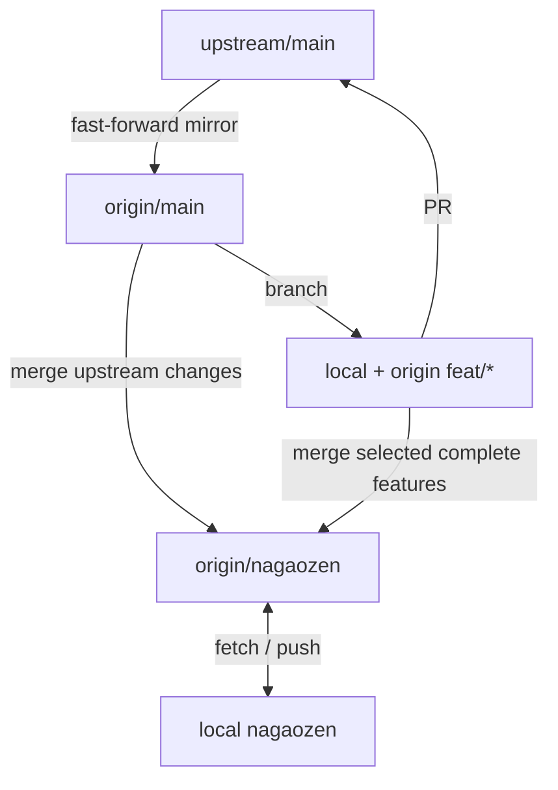

# Fork workflow: upstream mirror + customized integration branch

| Branch | Role |
| --- | --- |
| `upstream/main` | Official project; never pushed by these scripts |
| `origin/main` | Upstream-only mirror; routine updates are fast-forward only |
| `origin/nagaozen` / local `nagaozen` | Your customized integration branch |
| Local / origin `feat/*` | Focused feature branches; source of upstream PRs |
| `backup/*` | Recovery history; never merge diagnostic backups wholesale |



Keep fork-only changes out of `main`. Prefer merging entire feature branches into
`nagaozen`, preserving ancestry; cherry-pick when selecting only some commits.
Upstream may squash your PR, so later integration can still require conflict
resolution. This workflow separates responsibilities; it cannot eliminate conflicts.

## Requirements and authentication

Git is required for both routines, GitHub CLI (`gh`) for PR creation. Windows
Terminal users should use its PowerShell profile for `.ps1`, or Git Bash/WSL for
`.sh`. PowerShell scripts target Windows PowerShell 5.1 and PowerShell 7; no Bash,
Python, or Docker is needed on Windows. Run entry points normally, not dot-sourced.

```powershell
winget install --id Git.Git -e
winget install --id GitHub.cli -e
# Reopen the terminal after installation.
git remote -v
git remote set-url origin https://github.com/nagaozen/sandbox.git
git remote set-url upstream https://github.com/agent-infra/sandbox.git
gh auth login --hostname github.com --git-protocol https --scopes repo,workflow
gh auth setup-git
```

Use `git remote add` instead of `set-url` if a remote does not exist. Inspect
explicit push URLs with `git remote get-url --push --all origin`; replace any
old SSH push URL with `git remote set-url --push origin https://github.com/nagaozen/sandbox.git`.
HTTPS avoids blocked SSH port 22. Standard GitHub SSH URLs remain supported if you
have working SSH authentication. Docker MCP authentication is separate from Git
on Windows. Authenticate in each environment you use; do not paste tokens into
scripts. These scripts never search for credentials or upload bundles.

If local PowerShell scripts are blocked, review them first. On a personal machine:

```powershell
Set-ExecutionPolicy -Scope Process -ExecutionPolicy RemoteSigned
# For reviewed downloaded scripts, if necessary:
Get-ChildItem .\scripts\*.ps1 | Unblock-File
```

Do not override organizational policy. No machine-wide policy change is needed.

## One-time migration for this existing checkout (Windows)

The old fork `main` includes your Node 24 feature; the old local `main` also
contains diagnostic/store/bundle commits. Do not merge local main into nagaozen.
Remote `nagaozen` and `backup/main-before-nagaozen` have been created from the
old fork main (`62e1cfb1`). A local `backup/local-main-before-nagaozen` ref also
preserves the original committed local history. A branch backup does not include
uncommitted changes.

Close background tools that modify the checkout before migration. Ensure you have
enough disk space for the stash (tracked package-store files can be large).

```powershell
# From the existing checkout on main:
.\scripts\migrate-to-nagaozen.ps1          # Fetch and print the plan only
.\scripts\migrate-to-nagaozen.ps1 -Apply   # Execute after reviewing the plan
```

The migration:

1. Validates the remotes, branch roles, clean operation state and Git identity.
2. Creates unique local backup refs for local main and the fetched fork main.
3. Snapshots the named workflow scripts outside the checkout; stashes uncommitted
   tracked and untracked changes if present. Ignored files are not stashed and are
   not deliberately cleaned. Git refuses a checkout that would overwrite them.
4. Creates local `nagaozen` from `origin/nagaozen`. Copies only the reviewed workflow
   scripts and adds ignore patterns for diagnostic artifacts; commits those paths.
   **Other local-only changes remain in the backup/stash**, not silently published.
5. Merges the fetched upstream main. Conflicts stop the migration before any push.
6. Atomically backs up old remote main, pushes nagaozen, and realigns remote main to
   upstream with an **exact `--force-with-lease=refs/heads/main:<fetched-old-sha>`**.
   Only this one-time migration permits rewriting main. Concurrent remote changes
   reject the push. Branch protection may also reject it; do not bypass protection.
7. Verifies all remote refs, moves local main to the upstream snapshot, and leaves
   you on local nagaozen tracking origin/nagaozen.

It never deletes feature branches or changes upstream. Existing upstream PR #238
is left alone. It does not change the fork's default branch on GitHub.

On interruption, inspect `git status`, `git branch -vv`, `git stash list`, and
remote refs. The script stops if local nagaozen already exists rather than
recreating it. Backups and temporary script snapshots are intentionally retained.
Do not rerun with resets/force to bypass guards. Recover other intended files
selectively from the printed backup/stash after inspecting their diffs; do not
`stash pop` the entire diagnostic history onto nagaozen.

## 1. Routine upstream update

Start on a clean local `nagaozen` checkout after migration:

```powershell
git switch nagaozen
.\scripts\update-from-upstream.ps1
```

```bash
git switch nagaozen
bash scripts/update-from-upstream.sh
```

Both versions fetch the upstream snapshot and origin branches, require origin/main
to be fast-forwardable to upstream, and refuse local/remote nagaozen divergence.
If local nagaozen is behind its remote, it fast-forwards. It then merges upstream
into local nagaozen, preserving customizations, and **atomically pushes both main
and nagaozen**. No remote updates occur if the merge fails. No reset, automatic
stash, force-push, branch deletion, or upstream push occurs in routine updates.
Local `main` is not checked out or moved by this routine; use `origin/main` as the
fresh base for features.

Pre-existing unpublished local commits are listed and require explicit approval:

```powershell
.\scripts\update-from-upstream.ps1 -AllowLocalCommits
```

```bash
bash scripts/update-from-upstream.sh --allow-local-commits
```

Only pass that flag after reviewing the listed commits. A retry after a failed
push or a manually resolved merge may also need it. The flag does not permit
local/remote divergence or a main mirror rewrite.

On a conflict, resolve files, stage specific paths, `git commit`, then rerun with
the approval flag. Alternatively use `git merge --abort`. A failed remote push
leaves local integration work intact for inspection/retry. Remote pushes are
atomic with each other, not with local changes. Concurrent changes may reject the
push; fetch and inspect before retrying. The scripts verify the resulting refs.
Run your relevant build/tests after integration; scripts do not run project tests.

## 2. Feature development and upstream PR

Upstream-bound features start from **origin/main**, not nagaozen. Fork-only
features may start from nagaozen but should not be sent upstream with unrelated
customizations. PR scripts require a `feat/*` branch and push the whole branch.
They show proposed commits but cannot determine whether every commit is intended.

Because these workflow scripts live on nagaozen, they may not exist on a clean
upstream-based feature branch. Use a separate worktree and invoke the scripts
from the integration checkout. Examples start from the root of your nagaozen checkout:

**PowerShell:**

```powershell
$workflow = Join-Path (Get-Location).Path 'scripts'
git worktree add ..\sandbox-feature -b feat/my-change origin/main
Push-Location ..\sandbox-feature
# Edit, stage specific paths, commit, test, and review git diff origin/main...HEAD.
& (Join-Path $workflow 'open-upstream-pr.ps1') -Title 'feat: my change' -Body 'Summary and tests'
Pop-Location
```

**Bash:**

```bash
workflow="$PWD/scripts"
git worktree add ../sandbox-feature -b feat/my-change origin/main
cd ../sandbox-feature
# Edit, stage specific paths, commit, test, and review git diff origin/main...HEAD.
bash "$workflow/open-upstream-pr.sh" --title 'feat: my change' --body 'Summary and tests'
cd -
```

Then integrate the complete feature from your nagaozen checkout:

```text
git switch nagaozen
git merge --no-ff feat/my-change
```

Test before publishing via the sync script with its local-commit approval flag.
For selective integration, use `git cherry-pick <commit>` instead of merging,
understanding it creates a new commit identity.

PR destination is fixed to `agent-infra/sandbox:main` with head
`nagaozen:feat/my-change`. An existing open PR for the head/base is updated by the
push and its URL printed; no duplicate is created and title/body are unchanged.
PR creation failure after a successful push leaves the feature branch on origin;
fix the error and retry. PR scripts do not merge PRs or resolve their conflicts.

| Presentation option | Bash | PowerShell |
| --- | --- | --- |
| Title | `--title '...'` | `-Title '...'` |
| Body | `--body '...'` | `-Body '...'` |
| UTF-8 body file | `--body-file path` | `-BodyFile path` |
| Draft | `--draft` | `-Draft` |
| Fill from commits | `--fill` | `-Fill` |
| Fill from first commit | `--fill-first` | `-FillFirst` |
| Verbose fill | `--fill-verbose` | `-FillVerbose` |

With no options, fill is the default. Use `-Draft -Fill` / `--draft --fill` to
avoid title/body prompts. Body files are preferred for embedded quotes on Windows
PowerShell 5.1. Fill variants require a supporting gh version.

Routine scripts accept `BASE_BRANCH` (default main) and the sync script accepts
`MINE_BRANCH` (default nagaozen) as environment variables. Branches must already
exist remotely. The one-time migration intentionally supports only main/nagaozen.
